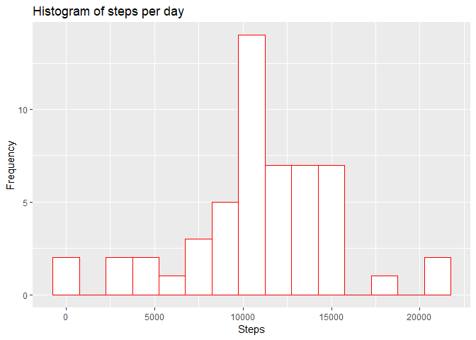
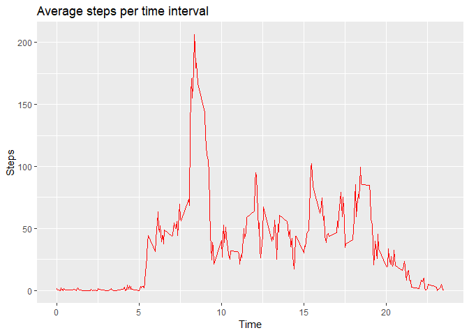
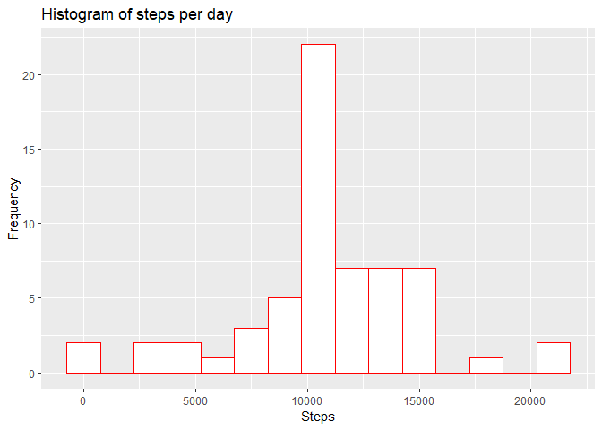
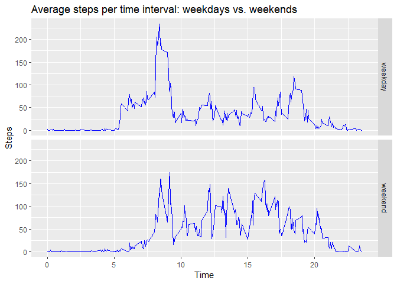

## Loading and preprocessing the data

```r
activity <- read.csv("activity.csv")
activity$date <- as.Date(activity$date, format = "%Y-%m-%d")
```

## What is mean total number of steps taken per day?

```r
library(ggplot2)
StepsPerDay <- aggregate(activity$steps, list(activity$date), FUN=sum)
colnames(StepsPerDay) <- c("Date", "Steps")
StepsPerDay
```

```
##          Date Steps
## 1  2012-10-01    NA
## 2  2012-10-02   126
## 3  2012-10-03 11352
## 4  2012-10-04 12116
## 5  2012-10-05 13294
## 6  2012-10-06 15420
## 7  2012-10-07 11015
## 8  2012-10-08    NA
## 9  2012-10-09 12811
## 10 2012-10-10  9900
## 11 2012-10-11 10304
## 12 2012-10-12 17382
## 13 2012-10-13 12426
## 14 2012-10-14 15098
## 15 2012-10-15 10139
## 16 2012-10-16 15084
## 17 2012-10-17 13452
## 18 2012-10-18 10056
## 19 2012-10-19 11829
## 20 2012-10-20 10395
## 21 2012-10-21  8821
## 22 2012-10-22 13460
## 23 2012-10-23  8918
## 24 2012-10-24  8355
## 25 2012-10-25  2492
## 26 2012-10-26  6778
## 27 2012-10-27 10119
## 28 2012-10-28 11458
## 29 2012-10-29  5018
## 30 2012-10-30  9819
## 31 2012-10-31 15414
## 32 2012-11-01    NA
## 33 2012-11-02 10600
## 34 2012-11-03 10571
## 35 2012-11-04    NA
## 36 2012-11-05 10439
## 37 2012-11-06  8334
## 38 2012-11-07 12883
## 39 2012-11-08  3219
## 40 2012-11-09    NA
## 41 2012-11-10    NA
## 42 2012-11-11 12608
## 43 2012-11-12 10765
## 44 2012-11-13  7336
## 45 2012-11-14    NA
## 46 2012-11-15    41
## 47 2012-11-16  5441
## 48 2012-11-17 14339
## 49 2012-11-18 15110
## 50 2012-11-19  8841
## 51 2012-11-20  4472
## 52 2012-11-21 12787
## 53 2012-11-22 20427
## 54 2012-11-23 21194
## 55 2012-11-24 14478
## 56 2012-11-25 11834
## 57 2012-11-26 11162
## 58 2012-11-27 13646
## 59 2012-11-28 10183
## 60 2012-11-29  7047
## 61 2012-11-30    NA
```

```r
g <- ggplot(StepsPerDay, aes(Steps))
g + geom_histogram(binwidth = 1500,col="red", fill="white") + 
        ggtitle("Histogram of steps per day")+
        xlab("Steps")+
        ylab("Frequency")
```

```
## Warning: Removed 8 rows containing non-finite values (stat_bin).
```

<!-- -->

```r
paste("Mean Steps per Day =", mean(StepsPerDay$Steps, na.rm=TRUE))
```

```
## [1] "Mean Steps per Day = 10766.1886792453"
```

```r
paste("Median Steps per Day =", median(StepsPerDay$Steps, na.rm=TRUE))
```

```
## [1] "Median Steps per Day = 10765"
```

## What is the average daily activity pattern?

```r
# create table with steps per time
StepsAvgPerDay <- aggregate(steps~interval,data=activity,FUN=mean,na.action=na.omit)

# 5-min interval 
StepsAvgPerDay$time <- StepsAvgPerDay$interval/100

# draw the time series plot
h <- ggplot(StepsAvgPerDay, aes(time, steps))
h + geom_line(col="red")+
        ggtitle("Average steps per time interval")+
        xlab("Time")+
        ylab("Steps")
```

<!-- -->

#### The 5-minute interval that, on average, contains the maximum number of steps

```r
# create table with steps per time
StepsAvgInterval <- aggregate(steps~interval,data=activity,FUN=mean,na.action=na.omit)

# Creating interval
StepsAvgInterval$time <- StepsAvgInterval$interval/100

# Plotting values
h <- ggplot(StepsAvgInterval, aes(time, steps)) +
        geom_line()

paste("5-minute interval that, on average, contains the maximum number of steps =", StepsAvgInterval$interval[which.max(StepsAvgInterval$steps)])
```

```
## [1] "5-minute interval that, on average, contains the maximum number of steps = 835"
```

## Imputing missing values

#### Calculate and report the total number of missing values in the dataset (i.e. the total number of rows with NA.

```r
activity <- read.csv("activity.csv")
sum(is.na(activity$steps))
```

```
## [1] 2304
```

#### Devise a strategy for filling in all of the missing values in the dataset. The strategy does not need to be sophisticated. For example, you could use the mean/median for that day, or the mean for that 5-minute interval, etc.

```r
#activity$steps<- ifelse(is.na(activity$steps), 
#                                 mean(activity$steps, na.rm=TRUE), 
#                                 activity$steps)
```
#### The missing data will be replaced with the mean of steps.

#### Create a new dataset that is equal to the original dataset but with the missing data filled in.

```r
updatedActivity <- read.csv("activity.csv")
updatedActivity$date <- as.Date(updatedActivity$date, format = "%Y-%m-%d")
updatedActivity$steps<- ifelse(is.na(updatedActivity$steps), 
                                  mean(updatedActivity$steps, na.rm=TRUE), 
                                  updatedActivity$steps)
sum(is.na(updatedActivity$steps))
```

```
## [1] 0
```
#### Make a histogram of the total number of steps taken each day and Calculate and report the mean and median total number of steps taken per day. Do these values differ from the estimates from the first part of the assignment? What is the impact of imputing missing data on the estimates of the total daily number of steps?

```r
StepsPerDay <- aggregate(updatedActivity$steps, list(updatedActivity$date), FUN=sum)
colnames(StepsPerDay) <- c("Date", "Steps")
StepsPerDay
```

```
##          Date    Steps
## 1  2012-10-01 10766.19
## 2  2012-10-02   126.00
## 3  2012-10-03 11352.00
## 4  2012-10-04 12116.00
## 5  2012-10-05 13294.00
## 6  2012-10-06 15420.00
## 7  2012-10-07 11015.00
## 8  2012-10-08 10766.19
## 9  2012-10-09 12811.00
## 10 2012-10-10  9900.00
## 11 2012-10-11 10304.00
## 12 2012-10-12 17382.00
## 13 2012-10-13 12426.00
## 14 2012-10-14 15098.00
## 15 2012-10-15 10139.00
## 16 2012-10-16 15084.00
## 17 2012-10-17 13452.00
## 18 2012-10-18 10056.00
## 19 2012-10-19 11829.00
## 20 2012-10-20 10395.00
## 21 2012-10-21  8821.00
## 22 2012-10-22 13460.00
## 23 2012-10-23  8918.00
## 24 2012-10-24  8355.00
## 25 2012-10-25  2492.00
## 26 2012-10-26  6778.00
## 27 2012-10-27 10119.00
## 28 2012-10-28 11458.00
## 29 2012-10-29  5018.00
## 30 2012-10-30  9819.00
## 31 2012-10-31 15414.00
## 32 2012-11-01 10766.19
## 33 2012-11-02 10600.00
## 34 2012-11-03 10571.00
## 35 2012-11-04 10766.19
## 36 2012-11-05 10439.00
## 37 2012-11-06  8334.00
## 38 2012-11-07 12883.00
## 39 2012-11-08  3219.00
## 40 2012-11-09 10766.19
## 41 2012-11-10 10766.19
## 42 2012-11-11 12608.00
## 43 2012-11-12 10765.00
## 44 2012-11-13  7336.00
## 45 2012-11-14 10766.19
## 46 2012-11-15    41.00
## 47 2012-11-16  5441.00
## 48 2012-11-17 14339.00
## 49 2012-11-18 15110.00
## 50 2012-11-19  8841.00
## 51 2012-11-20  4472.00
## 52 2012-11-21 12787.00
## 53 2012-11-22 20427.00
## 54 2012-11-23 21194.00
## 55 2012-11-24 14478.00
## 56 2012-11-25 11834.00
## 57 2012-11-26 11162.00
## 58 2012-11-27 13646.00
## 59 2012-11-28 10183.00
## 60 2012-11-29  7047.00
## 61 2012-11-30 10766.19
```

```r
g <- ggplot(StepsPerDay, aes(Steps))
g + geom_histogram(binwidth = 1500,col="red", fill="white") + 
        ggtitle("Histogram of steps per day")+
        xlab("Steps")+
        ylab("Frequency")
```

<!-- -->

```r
paste("Mean Steps per Day =", mean(StepsPerDay$Steps, na.rm=TRUE))
```

```
## [1] "Mean Steps per Day = 10766.1886792453"
```

```r
paste("Median Steps per Day =", median(StepsPerDay$Steps, na.rm=TRUE))
```

```
## [1] "Median Steps per Day = 10766.1886792453"
```
#### The values have not changed. The only difference is that the higher frequency bar for the histogram has increased frequency.


## Are there differences in activity patterns between weekdays and weekends?

```r
library(ggplot2)
activity$date <- as.Date(activity$date, format = "%Y-%m-%d")

# create a variable with weekdays name
activity$weekday <- weekdays(activity$date)

# create a new variable indicating weekday or weekend
activity$DayType <- ifelse(activity$weekday=='Saturday' | activity$weekday=='Sunday', 'weekend','weekday')

# create table with steps per time across weekdaydays or weekend days
StepsDayType <- aggregate(steps~interval+DayType,data=activity,FUN=mean,na.action=na.omit)

# variable time
StepsDayType$time <- StepsDayType$interval/100

# draw the line plot
j <- ggplot(StepsDayType, aes(time, steps))
j + geom_line(col="blue") +
        ggtitle("Average steps per time interval: weekdays vs. weekends") +
        xlab("Time")+
        ylab("Steps")+
        facet_grid(DayType ~ .)
```

<!-- -->

```r
StepsDayTypeWeekday <- subset(StepsDayType, DayType == "weekday")
StepsDayTypeWeekend <- subset(StepsDayType, DayType == "weekend")

StepsDayTypeWeekday$interval[which.max(StepsDayTypeWeekday$steps)]
```

```
## [1] 835
```

```r
StepsDayTypeWeekday$interval[which.min(StepsDayTypeWeekday$steps)]
```

```
## [1] 40
```

```r
StepsDayTypeWeekend$interval[which.max(StepsDayTypeWeekend$steps)]
```

```
## [1] 915
```

```r
StepsDayTypeWeekend$interval[which.min(StepsDayTypeWeekend$steps)]
```

```
## [1] 0
```

#### There is definitely difference in activity patterns between weekdays and weekends. The high activity on weekdays is during the 8:35am interval whereas over the weekend it is close to 9am. 
